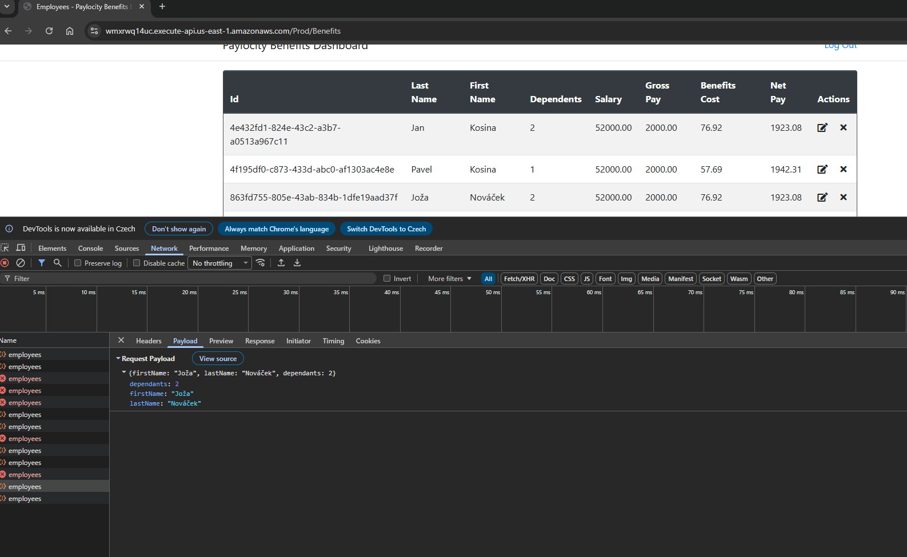
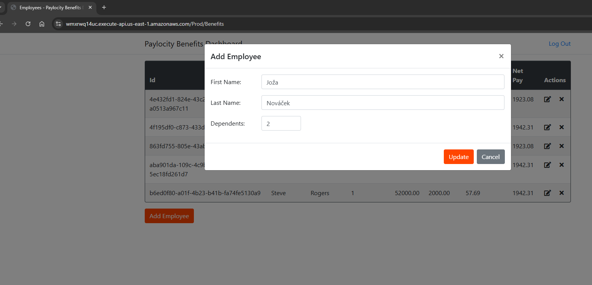

# UI Bugs

## UI-001
### Title
First Name and Last Name are displayed in reversed order in employee table

### Severity
Medium

### Description
Employee first name and last name are displayed in the wrong columns in the employee table.
The issue occurs despite correct data being sent in the request payload.

### Steps to Reproduce
1. Log in to the application
2. Click **Add Employee**
3. Enter:
   - First Name: Joža
   - Last Name: Nováček
   - Dependents: 2
4. Submit the form
5. Observe the employee table

### Expected Result
The **First Name** column should display `Joža` and the **Last Name** column should display `Nováček`.

### Actual Result
The **First Name** column displays `Nováček` and the **Last Name** column displays `Joža`.

### Evidence
Request payload shows:
- `firstName: "Joža"`
- `lastName: "Nováček"`

UI table displays these values in reversed columns:

### Impact
Incorrect employee data is presented to the user, which may lead to confusion and misidentification.

## UI-002
### Title
Edit Employee modal incorrectly labeled as "Add Employee"

### Severity
Low

### Description
When editing an existing employee, the modal dialog is labeled "Add Employee" instead of indicating edit/update mode.

### Steps to Reproduce
1. Log in to the application
2. Click the Edit action for an employee
3. Observe the modal dialog title

### Expected Result
Modal should display a context-appropriate title such as "Edit Employee" or "Update Employee".

### Actual Result
Modal title displays "Add Employee" even in edit mode, while the action button says "Update".

### Evidence

### Impact
This creates inconsistent UI behavior and may confuse users about whether they are creating a new employee or editing an existing one.